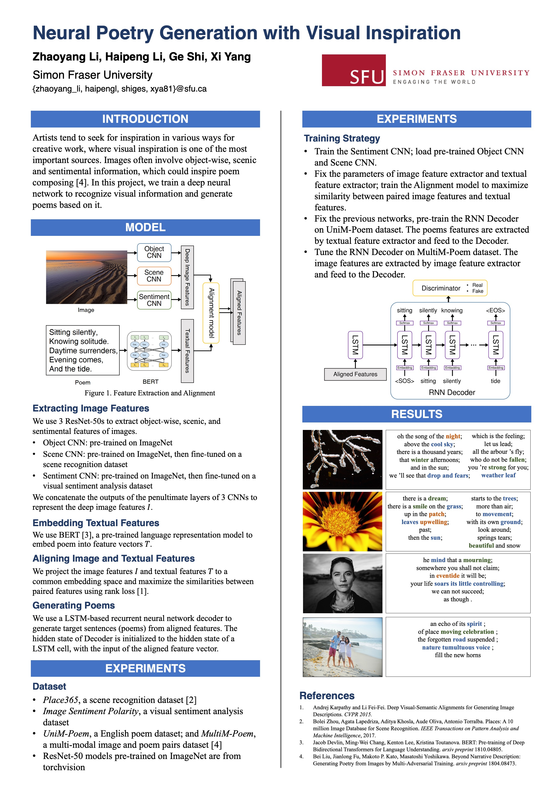

# Neural Poetry Generation with Visual Inspiration
Final project for CMPT419: Neural Poetry Generation with Visual Inspiration

## Poster & report



[Report](419_PoemGen_Report.pdf)

## Download dataset

```bash
python download_image.py
```
Dataset from [link](https://github.com/bei21/img2poem)

## Extract poem & img feature

```
python extract_feature -s poem
python extract_feature -s img
```

Output will be a dictionary of (id, feature) pairs
where feature is a 512 dimension numpy vector.

Output will be saved to `data/poem_features.plk` or 
`data/img_features.plk`

## Training

Before training, build vocabulary file, the vocabulary file will be
saved to data/vocab.pkl
```
python vocab_builder.py 
```

### Pretrain on Unim

```
python train_adversarial.py
```

### Tune on multim

```
python train_adversarial.py --source multim
```

Use `-h` flag to see more options

## Reference

[Beyond Narrative Description: Generating Poetry from Images by Multi-Adversarial Training](https://arxiv.org/abs/1804.08473)